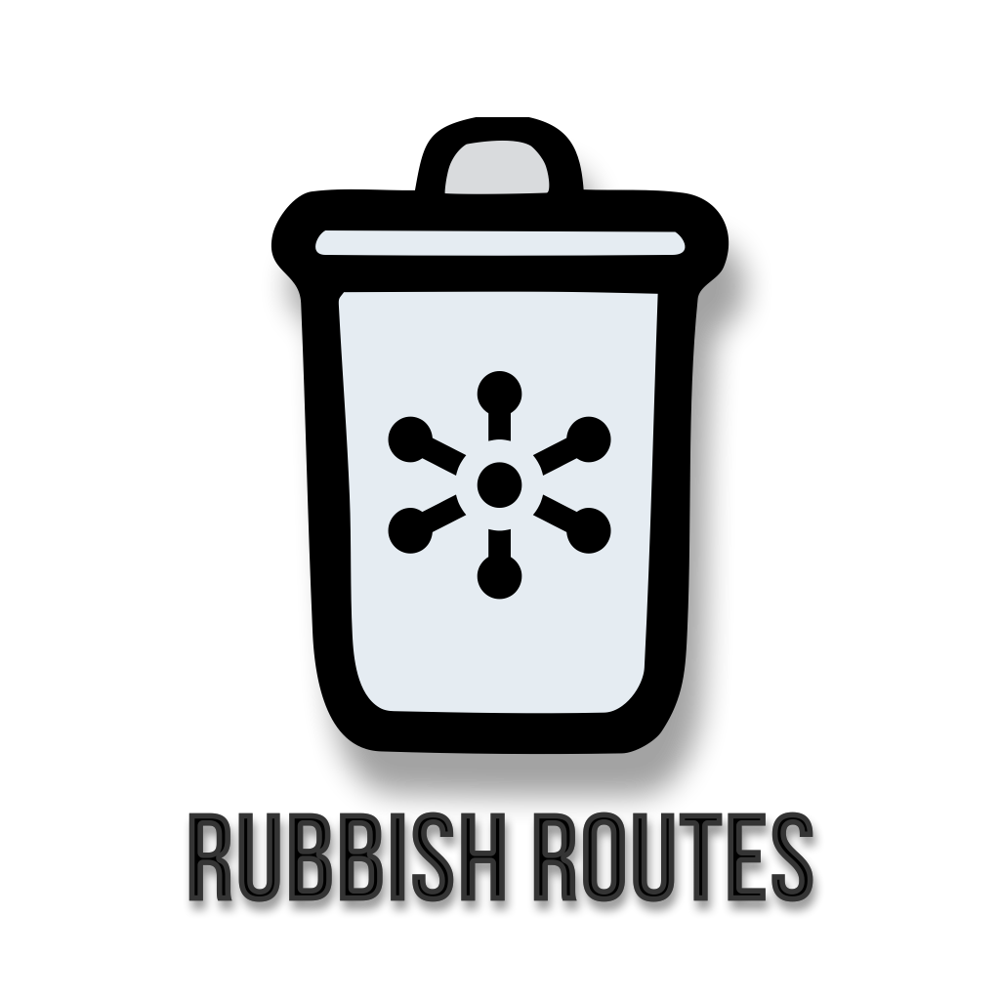

# RubbishRoutes

## Introduction


RubbishRoutes is a CLI tool designed to streamline the development process by automating the creation of CRUD (Create, Read, Update, Delete) operations for Node.js applications. It offers a quick and easy way to generate boilerplate code for your RESTful APIs, saving time and reducing the potential for errors.

## Features

- Generate CRUD operation files with a single command.
- Supports common REST API endpoints.
- Customizable file generation based on user-defined models and paths.
- Interactive CLI prompts for ease of use.

## Installation

To install RubbishRoutes, run the following command in your terminal:

```bash
npm install -g rubbishroutes
```

This will install RubbishRoutes globally on your system, allowing it to be run from any project directory.

## Usage

RubbishRoutes is designed to be intuitive and easy to use. Below are some common use cases:

### Generating a Full CRUD for a Model

To generate all CRUD operations for a model, navigate to your project's root directory and run:

```bash
rubbishroutes generate --model <ModelName> --path <TargetDirectory>
```

Example:

```bash
rubbishroutes generate --model User --path ./src/controllers
```

This command will generate `CreateUser`, `ReadUser`, `UpdateUser`, and `DeleteUser` functions in the specified directory.

### Generating Specific CRUD Operations

You can also generate specific CRUD operations by specifying the type:

```bash
rubbishroutes generate --type <OperationType> --model <ModelName> --path <TargetDirectory>
```

Available operation types: `create`, `read`, `update`, `delete`, `list`, `search`.

Example:

```bash
rubbishroutes generate --type create --model Product --path ./src/controllers
```

### Customizing File Paths

RubbishRoutes allows you to specify the target directory for the generated files. Use the `--path` option to define where your CRUD files should be created.

### Interactive Mode

If you run RubbishRoutes without any arguments, it will enter an interactive mode, prompting you for details:

```bash
rubbishroutes
```

## Advanced Configuration

RubbishRoutes supports advanced configurations through a `.rubbishroutesrc` file. This allows you to set default behaviors, templates, and other settings.

Example `.rubbishroutesrc`:

```json
{
  "defaultPath": "./src/controllers",
  "useMongoDB": true
}
```


Certainly! To make the usage of "RubbishRoutes" clearer, especially regarding its flags and how to chain them together, we can expand the `README.md` with more detailed explanations and examples. Here’s an improved usage section with comprehensive details about each flag and how they can be combined.

---

## Detailed Usage of RubbishRoutes

RubbishRoutes simplifies the process of generating CRUD operations for Node.js applications through a set of command-line flags. These flags can be combined to customize the generated code to fit your project's structure and requirements.

### Flags Overview

1. **`--model <ModelName>`**: Specifies the name of the model for which CRUD operations are to be generated. The model name is used in the generated files.

2. **`--type <OperationType>`**: Determines the type of CRUD operation to generate. Possible values include `create`, `read`, `update`, `delete`, `list`, and `search`. If this flag is omitted, all CRUD operations will be generated by default.

3. **`--path <TargetDirectory>`**: Defines the directory where the generated files will be placed. The path should be relative to the project's root directory.

### Combining Flags

You can combine these flags to tailor the generation process. Here are some examples of how to use them:

#### Generating All CRUD Operations for a Model

To generate all CRUD operations for a specific model, use the `--model` flag along with the `--path` flag:

```bash
rubbishroutes generate --model User --path ./src/controllers
```

This command generates all CRUD operation files for the `User` model in the `./src/controllers` directory.

#### Generating Specific CRUD Operations

To generate a specific CRUD operation, add the `--type` flag:

```bash
rubbishroutes generate --type create --model Product --path ./src/controllers
```

This command will only generate the `create` operation for the `Product` model.

#### Chaining Multiple Operations

You can run multiple commands in sequence to generate different operations for the same or different models:

```bash
rubbishroutes generate --type create --model Product --path ./src/controllers
rubbishroutes generate --type read --model Product --path ./src/controllers
```

This sequence of commands generates separate `create` and `read` operations for the `Product` model.

### Interactive Mode

If you prefer not to use flags, simply run `rubbishroutes` without any arguments to enter an interactive mode that guides you through the generation process:

```bash
rubbishroutes
```

In this mode, the tool will prompt you for the necessary information, such as the model name, operation type, and target directory.

---

By providing clear and detailed explanations along with practical examples, users can easily understand how to utilize the "RubbishRoutes" CLI tool effectively, tailoring it to their specific project needs. If there's more you'd like to add or modify, please let me know!


## Contributing

Contributions to RubbishRoutes are welcome! Please read our contributing guidelines for instructions on how to submit pull requests.

## License

RubbishRoutes is [MIT licensed](./LICENSE).

---

